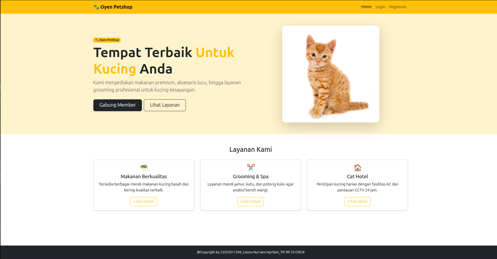
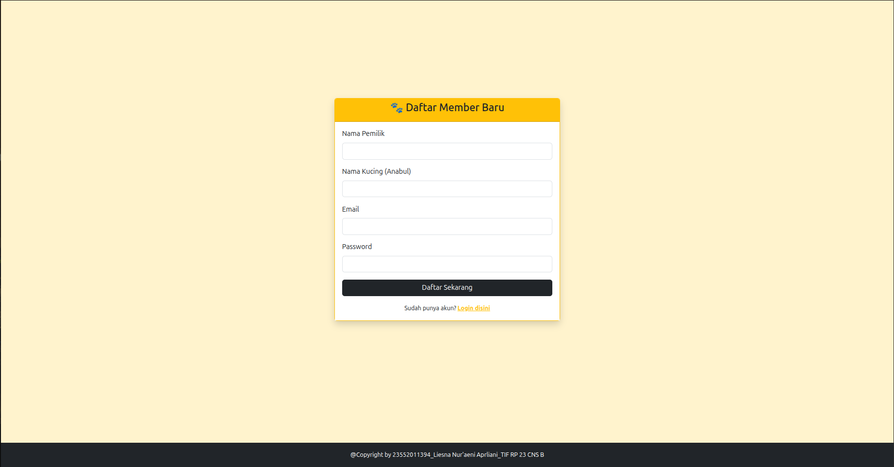
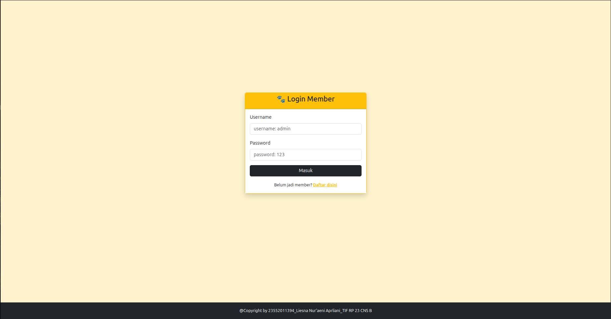
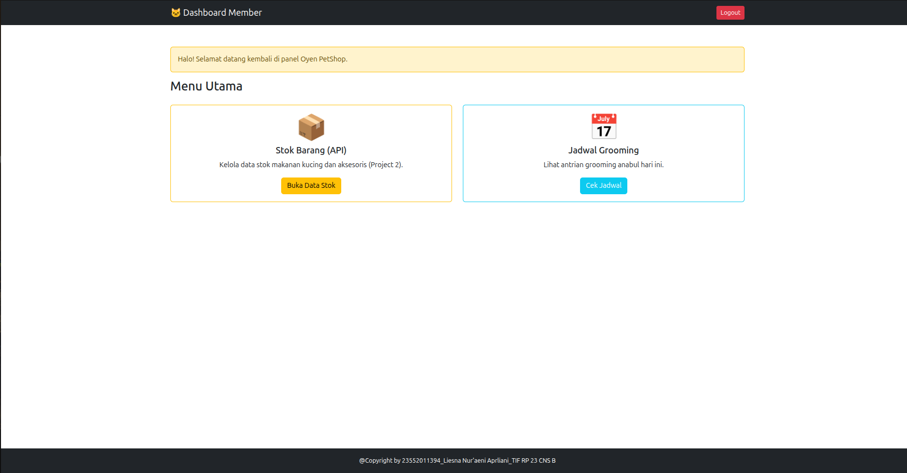
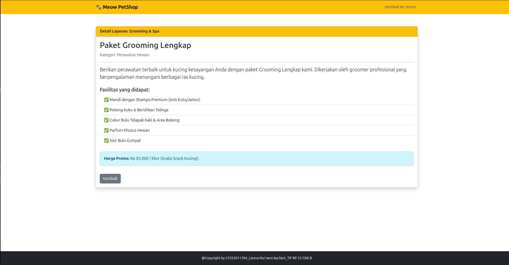
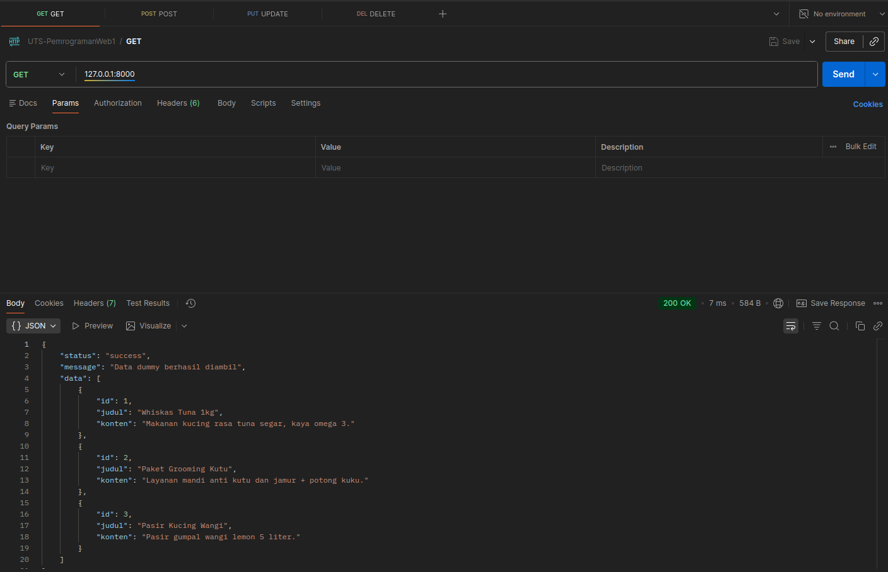
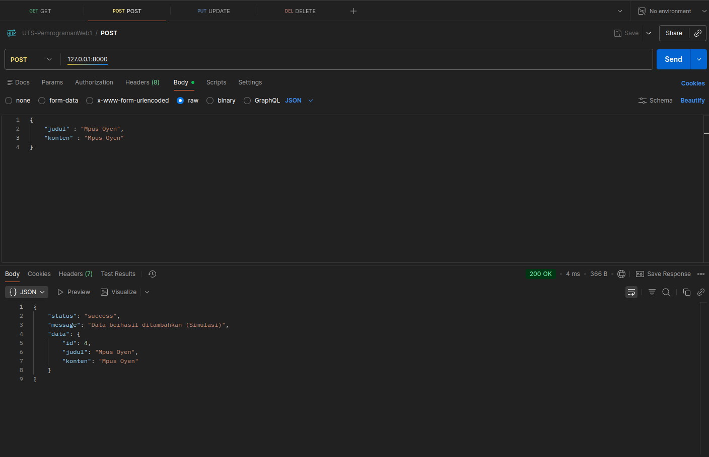
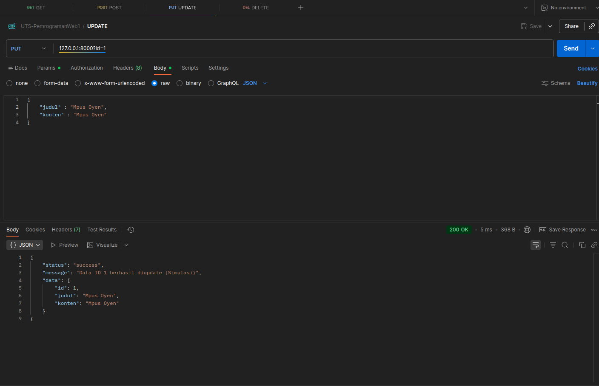
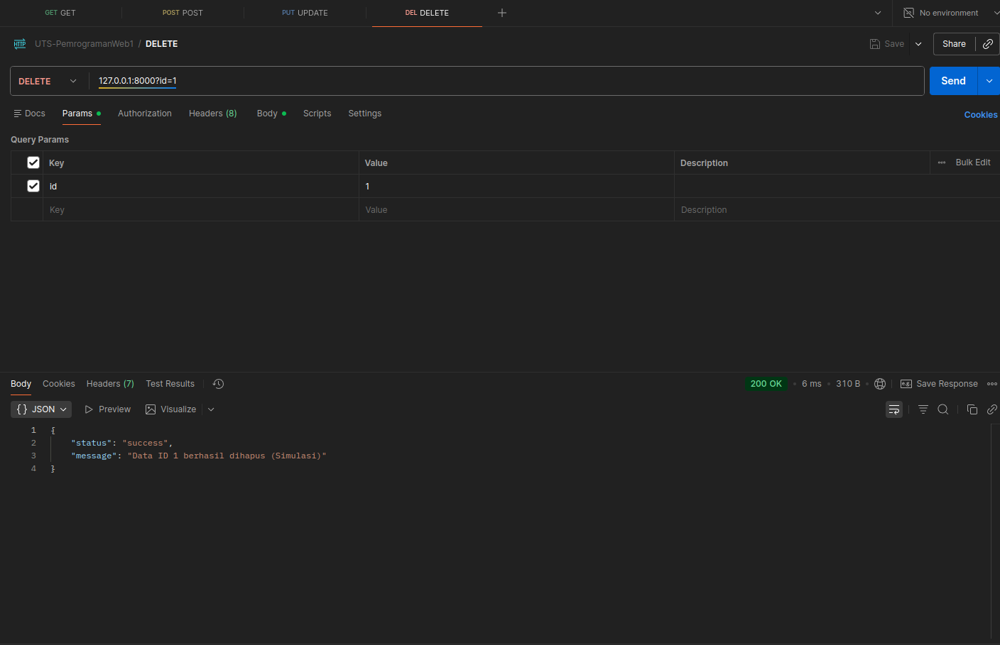

# UTS Pemrograman Web 1 - Universitas Teknologi Bandung

**Identitas Mahasiswa:**
* **Nama:** Liesna Nur'aeni Aprliani
* **NPM:** 23552011394
* **Kelas:** TIF RP 23 CNS B
* **Dosen:** Nova Agustina, S.T., M.Kom.

---

## Deskripsi Singkat
Repository ini berisi pengerjaan Ujian Tengah Semester (UTS) Pemrograman Web 1 yang terdiri dari dua proyek:
1.  **Project 1:** Pembuatan desain website Company Profile bertema "Oyen PetShop" menggunakan HTML, CSS Framework (Bootstrap 5), dan Validasi JavaScript.
2.  **Project 2:** Pembuatan Simple CRUD API menggunakan PHP Native (Data Dummy) untuk mengelola data layanan/produk.

---

## 📂 Project 1: Frontend Web (Meow PetShop)

### Fitur Utama:
* **Halaman Utama:** Menampilkan hero section dan daftar layanan.
* **Halaman Detail:** Informasi lengkap mengenai paket grooming/produk.
* **Halaman Login:** Validasi username & password menggunakan **JavaScript** (If/Else).
* **Halaman Registrasi:** Form pendaftaran member baru.
* **Dashboard:** Halaman menu utama setelah berhasil login.

### Screenshot Project 1:

**1. Halaman Utama (Home)**

**2. Halaman Registrasi**

**2. Halaman Login**

**3. Halaman Dashboard (Setelah Login)**

**3. Halaman Detail**

---

## 🚀 Project 2: CRUD API (Backend)

API ini dibuat menggunakan **PHP Native** dengan simulasi data dummy (JSON/Array) untuk menangani request HTTP.

**Base URL:** `http://localhost:8000/`

### Bukti Pengujian (Postman / Bruno):

**1. GET Request (Menampilkan Data)**
* **Hasil:** Menampilkan seluruh daftar produk/layanan.

**2. POST Request (Menambah Data)**
* **Hasil:** Mengembalikan respons sukses penambahan data.

**3. PUT Request (Update Data)**

**4. DELETE Request (Hapus Data)**

---

---

@Copyright by 23552011394_Liesna Nur'aeni Aprliani_TIF RP 23 CNS B